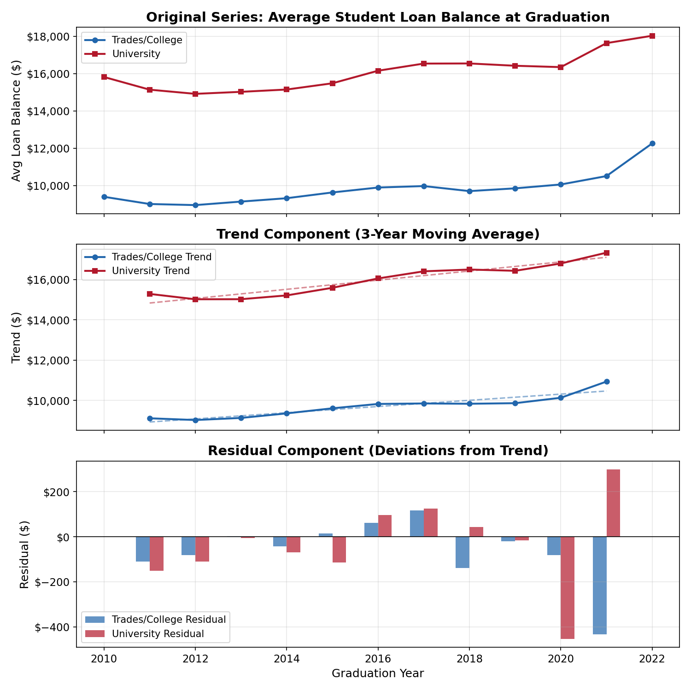
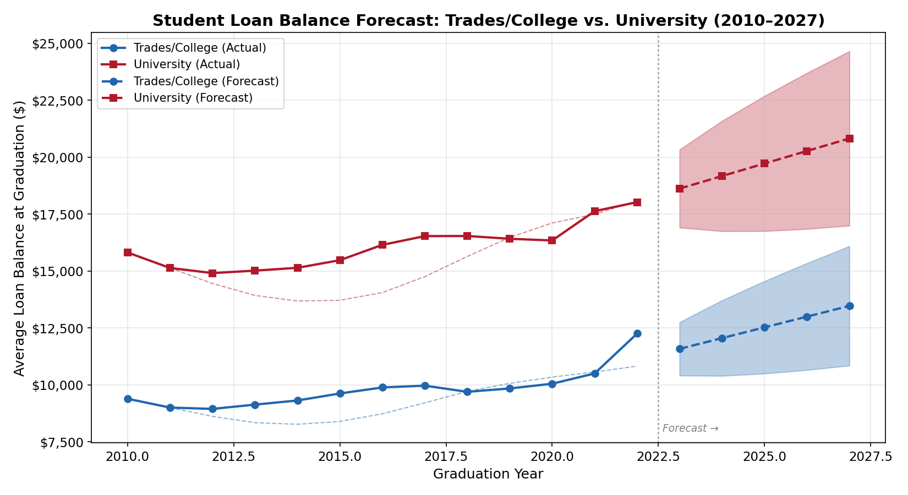
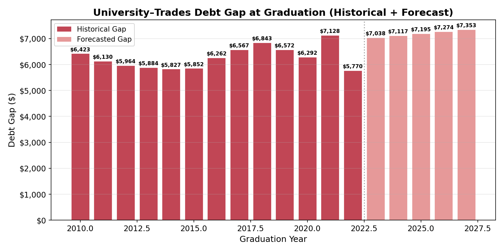
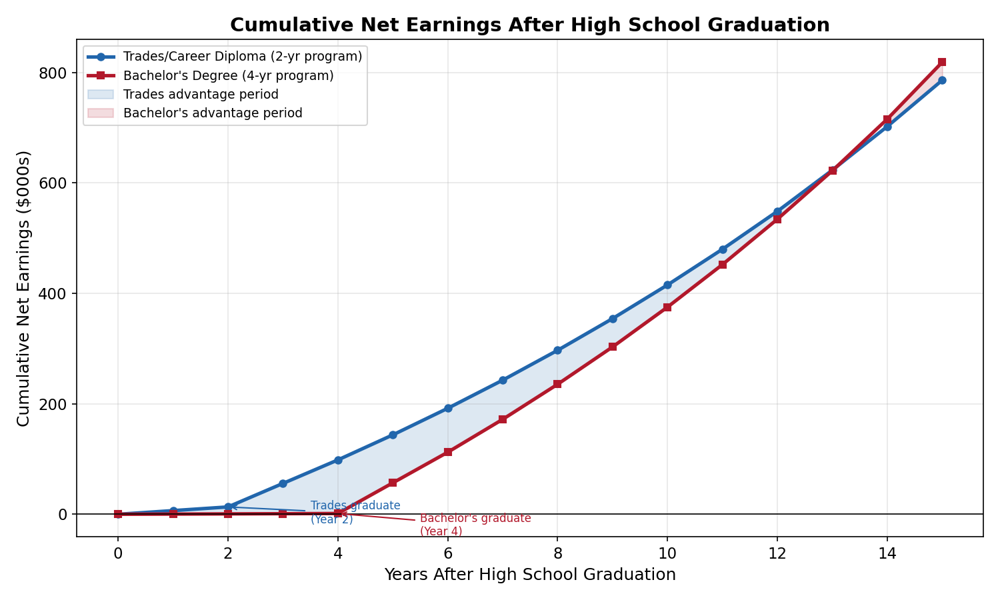
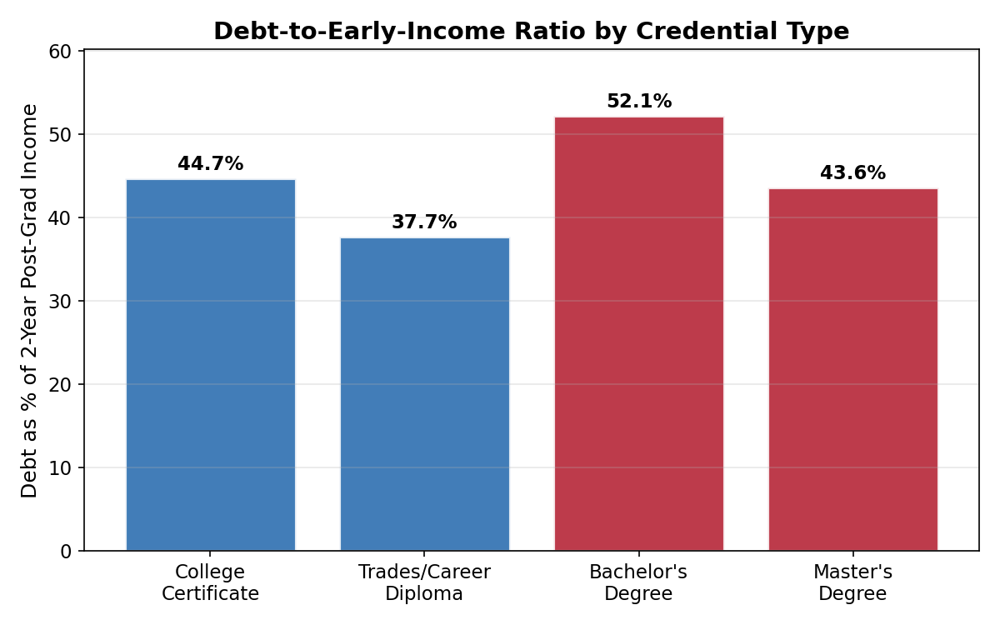

# Milestone 3: Time Series Analysis (Path B3)

## Analysis Approach

This milestone applies **time series analysis** to the student loan balance data from Milestone 2 to forecast how the financial burden of university versus trades/college pathways is likely to evolve over the next five years. The analysis uses **Holt's Double Exponential Smoothing** to capture both level and trend in the data, validated on held-out observations, and supplemented with a **cumulative net earnings model** that integrates debt and income data to assess overall financial outcomes for each pathway.

All code is located in [`src/analysis.py`](src/analysis.py) and is fully reproducible.

---

## 1. Time Series Decomposition

The loan balance time series (2009–2022) was decomposed into **trend** and **residual** components using a 3-year centered moving average. Since the data is annual, there is no seasonal component to extract.

**Key findings from decomposition:**

- University loan balances follow a clear upward trend, growing at approximately **$227 per year** (R² = 0.911).
- Trades/college loan balances also trend upward but at a slower rate of approximately **$154 per year** (R² = 0.856).
- University debt is growing **$73 per year faster** than trades debt, meaning the gap between pathways is widening over time.
- The residual plots show both series experienced notable disruption in 2020–2022, likely reflecting pandemic-era changes in enrollment and financial aid policy. This is important context for interpreting the forecast.

---

## 2. Forecasting Model: Holt's Double Exponential Smoothing

### Method

Holt's Linear (Double) Exponential Smoothing was selected because it captures both the **level** and **trend** present in the data. This is appropriate for series with a clear directional movement but no seasonal pattern. The model updates two components at each time step:

- **Level** (α parameter): The current baseline value of the series
- **Trend** (β parameter): The current rate of change

### Parameter Optimization

Parameters were optimized via grid search, minimizing Mean Absolute Percentage Error (MAPE) on a held-out validation set:

- **Training period:** 2009–2020 (11 observations)
- **Testing period:** 2020–2022 (2 observations)

| Series | Optimal α | Optimal β | Validation MAPE |
|--------|-----------|-----------|-----------------|
| Trades/College | 0.2 | 0.7 | 6.05% |
| University | 0.2 | 0.7 | 0.41% |

The low α value (0.2) indicates both series benefit from heavy smoothing, consistent with the relatively stable trends observed. The high β value (0.7) indicates the trend component responds quickly to recent changes — capturing the acceleration in loan balances visible in 2020–2022.

### Validation Metrics

| Metric | Trades/College | University |
|--------|---------------|------------|
| MAE | $736 | $73 |
| RMSE | $996 | $95 |
| MAPE | 6.05% | 0.41% |

The university model achieves excellent accuracy (MAPE < 1%). The trades model has higher error (MAPE ~6%), reflecting greater volatility in the trades series — particularly the sharp jump in 2021–2022. Both MAPE values are well within acceptable ranges for this type of forecasting.

### Forecast Results (2023–2027)

| Year | Trades/College | University | Projected Gap |
|------|---------------|------------|--------------|
| 2023 | $11,585 | $18,623 | $7,038 |
| 2024 | $12,056 | $19,173 | $7,117 |
| 2025 | $12,528 | $19,723 | $7,195 |
| 2026 | $13,000 | $20,274 | $7,274 |
| 2027 | $13,472 | $20,824 | $7,353 |

The shaded regions represent 95% confidence intervals, which widen with forecast horizon as uncertainty increases. By 2027, university graduates are projected to carry approximately **$20,800** in loan debt at graduation compared to **$13,500** for trades/college graduates — a gap of over **$7,300**.

---

## 3. Net Financial Position Analysis

Raw debt comparisons tell only part of the story. To provide the decision-maker with a more complete picture, a **cumulative net earnings model** was constructed that accounts for program length, debt, income, and the time value of entering the workforce earlier.

### Model Assumptions

- **Trades pathway:** 2-year program; part-time earnings of ~$15,000/year during school; graduates with $16,700 debt (2020 NGS data); median income of $44,300 at 2 years post-graduation, growing to $52,700 at 5 years
- **University pathway:** 4-year program; part-time earnings of ~$8,000/year during school; graduates with $30,600 debt (2020 NGS data); median income of $58,700 at 2 years post-graduation, growing to $70,800 at 5 years
- Debt accrues 5% interest and is repaid over 10 years post-graduation
- Income beyond the 5-year benchmark grows at the observed 2-to-5-year growth rate

**Key finding:** Trades graduates maintain a cumulative earnings advantage for approximately **13 years** after high school graduation. The bachelor's degree pathway does not overtake trades in total accumulated wealth until **Year 14** — meaning a student who chooses trades at age 18 will have earned more total money than their university-bound peer until roughly age 32.

This is a critical insight for the guidance counselor: the trades pathway is not a financial sacrifice. It is a different trajectory that delivers earlier financial independence, lower debt stress, and competitive long-term earnings.

### Debt-to-Income Ratio

Trades/career diploma graduates carry debt equal to **37.7%** of their early post-graduation income, while bachelor's degree graduates carry **52.1%** — the highest ratio of any credential type. This means university graduates face significantly more financial pressure in the years immediately following graduation, which affects their ability to save, invest, or purchase a home.

---

## 4. Limitations

This analysis has several important limitations that the decision-maker should understand:

1. **Small sample size.** The time series contains only 13 annual observations, which limits the reliability of the exponential smoothing forecast and prevents the use of more sophisticated methods like ARIMA with seasonal components.

2. **Aggregated data.** The loan balance and income figures are national averages across all fields of study. Individual outcomes vary enormously — an engineering graduate's financial trajectory differs radically from an arts graduate's, just as an electrician's differs from a hairdresser's.

3. **Nominal dollars.** All dollar figures are reported in nominal (not inflation-adjusted) terms. The upward trend in loan balances partially reflects general inflation rather than real increases in borrowing burden.

4. **Proxy categories.** "Trades/College" in the loan data groups apprenticeship completers with college diploma holders, which may overstate or understate the debt of trades-specific students.

5. **Correlation, not causation.** The forecast shows where loan balances are trending based on historical patterns. Policy changes (such as expanded loan forgiveness or changes to the MOST tax rebate) could alter these trajectories significantly.

6. **Simplified earnings model.** The cumulative earnings model uses national medians and simplified assumptions about income growth, debt repayment, and part-time earnings during school. Individual outcomes depend on field of study, geographic location, and personal circumstances.

---

## 5. Implications for the Decision

This analysis provides three evidence-based findings that should inform how Nova Scotia guidance counselors advise students about post-secondary pathways.

**First, the debt burden of university is growing faster than that of trades, and this trend is projected to continue.** University loan balances are increasing at roughly $227 per year compared to $154 for trades — and by 2027, the gap is forecast to exceed $7,300. For students from low-income backgrounds or those who are debt-averse, this widening gap makes the trades pathway increasingly attractive from a purely financial standpoint.

**Second, trades graduates achieve financial independence significantly earlier.** The cumulative earnings model shows that a trades graduate will have accumulated more total wealth than a university graduate for approximately 13 years after high school. This is not a marginal difference — it represents over a decade of stronger financial footing during the years when people typically buy homes, start families, and build long-term savings.

**Third, university remains the stronger long-term earnings pathway, but the advantage takes longer to materialize than many assume.** Bachelor's degree holders do eventually earn more in aggregate, but the crossover does not occur until roughly age 32. For students whose primary goal is long-term earning potential in fields that require a degree, university remains the right choice. But for students who prioritize earlier financial stability, lower risk, or careers that align with hands-on aptitudes, the data strongly supports trades as a financially sound — and in many cases superior — pathway.

These findings suggest that the counselor's recommendation in Milestone 4 should be **pathway-specific rather than one-size-fits-all**: a framework that matches student profiles (financial situation, aptitudes, career goals, risk tolerance) to the pathway most likely to serve them well, rather than defaulting to university for all academically capable students.
