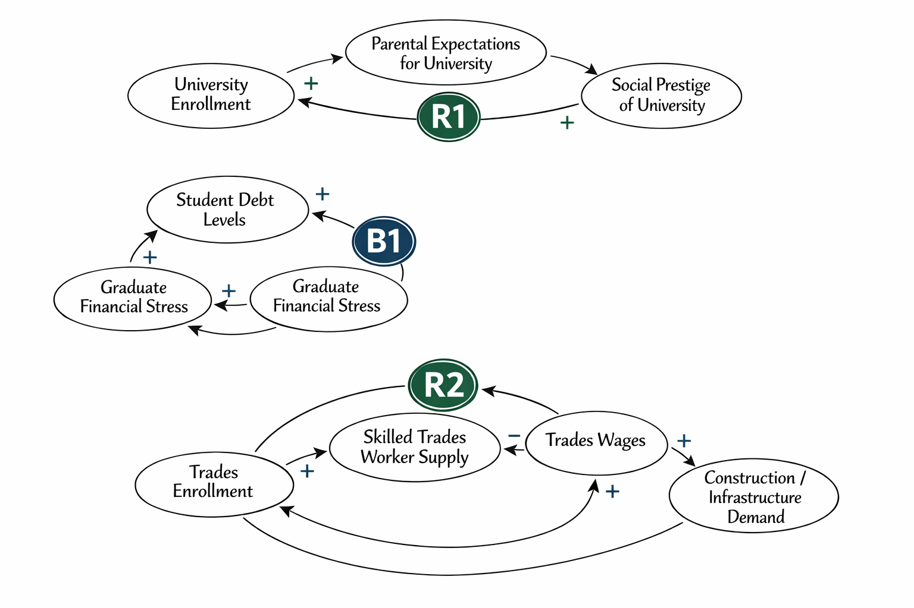

# Pathways to Prosperity: University or Skilled Trades?

## Decision Statement

Should a Nova Scotia high school guidance counselor prioritize encouraging students toward university programs or skilled trades/apprenticeships given current employment outcomes, earnings potential, and student debt levels?

## Executive Summary

Nova Scotia high school guidance counselors face an increasingly complex dilemma: should they continue the traditional practice of steering academically strong students toward university, or should they more actively promote skilled trades as a viable—and potentially superior—alternative? This decision carries profound implications for students' financial futures, career satisfaction, and the province's economic health.

The stakes are substantial on multiple fronts. On one hand, Nova Scotia faces a critical skilled trades shortage, with the province needing 11,000 new tradespeople by 2030 and labour gaps costing businesses approximately $1 billion in missed opportunities in 2022 alone. Thirty-five percent of current skilled trades workers are over 55 and approaching retirement, creating an urgent workforce crisis. On the other hand, the average Canadian university graduate carries $28,000-29,000 in student debt, taking an average of 10 years to repay these loans—a burden that significantly impacts young adults' ability to buy homes, start families, or pursue entrepreneurial ventures.

The earnings picture is more nuanced than conventional wisdom suggests. While bachelor's degree holders earn a median of $48,000 two years after graduation compared to $35,000 for college graduates overall, specific trades dramatically outperform this average. Graduates in mechanic and repair technologies earn $55,600 median income, and construction trades workers earn $54,100—exceeding many university degrees while avoiding substantial debt. However, lifetime earnings trajectories, career flexibility, and job satisfaction remain important considerations that vary significantly by field of study and individual circumstances.

This decision is particularly difficult because it challenges deeply ingrained cultural assumptions about success and educational pathways. Decades of policy emphasis on university education have created strong social prestige associations and parental expectations that counselors must navigate carefully. The 1996 shift that transformed free vocational training into tuition-charging NSCC programs further entrenched the perception that trades are a "second choice" rather than a strategic career decision. Counselors must balance these cultural forces with objective labor market data, individual student aptitudes, and the reality that a four-year degree is not the optimal path for every student—even those with strong academic capabilities.

## Initial Causal Loop Diagram

