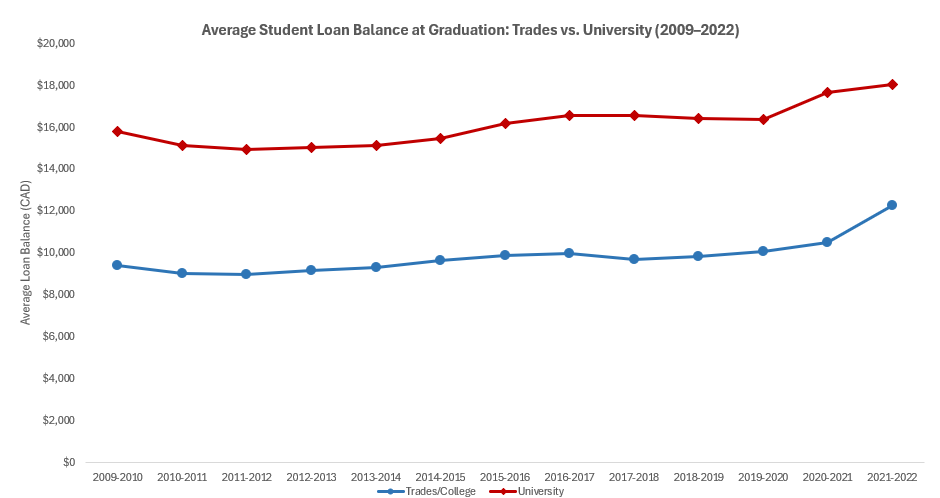
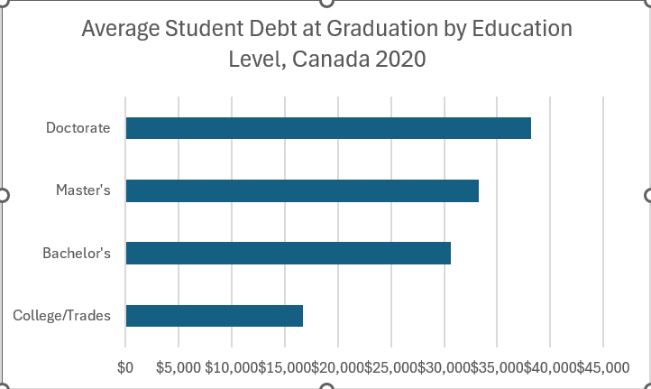
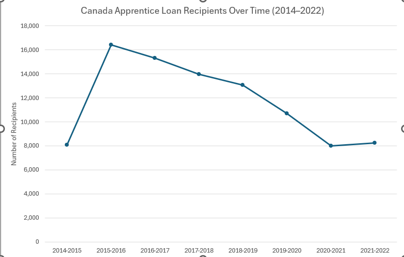
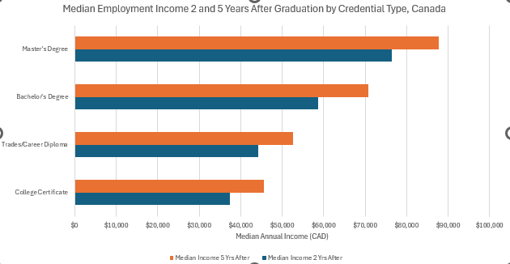
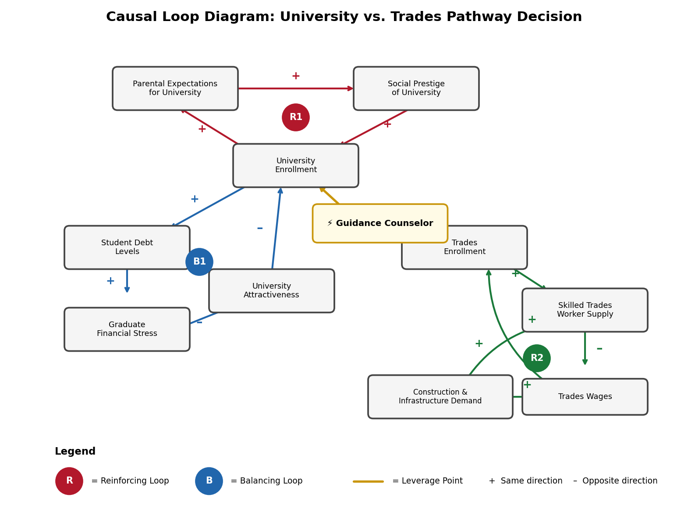

# Pathways to Prosperity: University or Skilled Trades?

## Decision Statement

Should a Nova Scotia high school guidance counselor prioritize encouraging students toward university programs or skilled trades/apprenticeships given current employment outcomes, earnings potential, and student debt levels?

## Executive Summary

Nova Scotia high school guidance counselors face an increasingly complex dilemma: should they continue the traditional practice of steering academically strong students toward university, or should they more actively promote skilled trades as a viable—and potentially superior—alternative? This decision carries profound implications for students' financial futures, career satisfaction, and the province's economic health.

The stakes are substantial on multiple fronts. On one hand, Nova Scotia faces a critical skilled trades shortage, with the province needing 11,000 new tradespeople by 2030 and labour gaps costing businesses approximately $1 billion in missed opportunities in 2022 alone. Thirty-five percent of current skilled trades workers are over 55 and approaching retirement, creating an urgent workforce crisis. On the other hand, the average Canadian university graduate carries $28,000-29,000 in student debt, taking an average of 10 years to repay these loans—a burden that significantly impacts young adults' ability to buy homes, start families, or pursue entrepreneurial ventures.

The earnings picture is more nuanced than conventional wisdom suggests. While bachelor's degree holders earn a median of $48,000 two years after graduation compared to $35,000 for college graduates overall, specific trades dramatically outperform this average. Graduates in mechanic and repair technologies earn $55,600 median income, and construction trades workers earn $54,100—exceeding many university degrees while avoiding substantial debt. However, lifetime earnings trajectories, career flexibility, and job satisfaction remain important considerations that vary significantly by field of study and individual circumstances.

This decision is particularly difficult because it challenges deeply ingrained cultural assumptions about success and educational pathways. Decades of policy emphasis on university education have created strong social prestige associations and parental expectations that counselors must navigate carefully. The 1996 shift that transformed free vocational training into tuition-charging NSCC programs further entrenched the perception that trades are a "second choice" rather than a strategic career decision. Counselors must balance these cultural forces with objective labor market data, individual student aptitudes, and the reality that a four-year degree is not the optimal path for every student—even those with strong academic capabilities.

---

## Milestone 2: Data Exploration & System Mapping

### Data Sources

Four datasets were used in this analysis, all sourced from Statistics Canada and Employment and Social Development Canada (ESDC). Full documentation for each dataset is available in the [data/README.md](data/README.md) file.

- **07-v-avlbal-pro-eng.csv** — Average federal student loan balance at time of leaving school, by study level and institution type (ESDC, 2009–2022)
- **3710003601-eng.csv** — Student debt from all sources at graduation, by province and level of study (Statistics Canada, 2000–2020)
- **45-n-cal-pt-eng.csv** — Number of Canada Apprentice Loan recipients by province and territory (ESDC, 2014–2022)
- **3710028001-eng.csv** — Median employment income of postsecondary graduates two and five years after graduation (Statistics Canada)

---

### Visualizations & Findings

#### Figure 1: Average Student Loan Balance at Graduation — Trades vs. University (2009–2022)

University graduates have consistently carried significantly higher debt loads than trades and college graduates over the entire 13-year period. Starting at approximately $15,800 in 2009-2010, university loan balances rose to $18,000 by 2021-2022. Trades and college graduates averaged around $9,400 at the start and $12,200 by the end — roughly 35% less debt at graduation. The gap widened in the final years, suggesting the debt divergence between pathways is accelerating. For the guidance counselor, students directed toward university are entering the labour market with substantially more financial burden, which raises the stakes considerably if employment outcomes are poor or delayed.

---

#### Figure 2: Average Student Debt at Graduation by Credential Level, Canada (2020)

This snapshot from the 2020 National Graduates Survey shows the stark difference in debt loads across credential types. College graduates carried an average of approximately $16,700 in debt, while bachelor's degree holders averaged $30,800 — nearly double. Master's graduates averaged $25,800 and doctoral graduates $34,400. For the decision-maker, university represents a fundamentally different financial commitment that students must weigh against expected employment outcomes. A guidance counselor who does not address this difference is withholding important information during a critical life decision.

---

#### Figure 3: Canada Apprentice Loan Recipients Over Time (2014–2022)

After a strong launch spike in 2015-2016 with 16,422 recipients nationally, the number of apprentices accessing the Canada Apprentice Loan declined steadily each year, falling to just 8,000 in 2020-2021 before a modest recovery to 8,249 in 2021-2022. This decline occurred even as trades labour shortages worsened across Canada. This suggests that awareness of trades financing options is low — students may be choosing university not because it is the better path, but because they are unaware that interest-free apprenticeship loans exist.

---

#### Figure 4: Median Employment Income 2 and 5 Years After Graduation by Credential Type

Career and trades graduates earned $44,300 at 2 years and $52,700 at 5 years after graduation — notably higher than college certificate holders and competitive with bachelor's degree holders ($58,700 at 2 years, $70,800 at 5 years). When debt load is factored in, trades graduates reach positive net financial position much earlier than university graduates. The strong 5-year income growth across all pathways suggests trades careers are not a financial dead end but a different trajectory — one that starts earlier and carries far less initial burden.

---

### Causal Loop Diagram

**R1 — University Prestige Reinforcing Loop:** High social prestige drives parental expectations for university, increasing enrollment, which further reinforces university as the default pathway. This self-reinforcing loop explains why university enrollment has continued growing even as labour market outcomes for graduates have deteriorated.

**B1 — Debt Stress Balancing Loop:** Rising enrollment increases student debt and graduate financial stress, which over time reduces the attractiveness of university — creating a natural brake on R1. The data in Figures 1 and 2 suggest this loop may be beginning to exert pressure.

**R2 — Trades Wage Reinforcing Loop:** Increased trades enrollment raises worker supply, and rising construction and infrastructure demand pushes wages upward, attracting more enrollment. If activated through stronger counselor messaging, this loop could help address Nova Scotia's trades shortage.

**Intervention point:** The guidance counselor sits at the intersection of R1 and R2. By providing balanced information about debt loads, income outcomes, and available financing options, counselors can weaken R1 and strengthen R2 — nudging the system toward better balance.

---

## Milestone 3: Time Series Analysis (Path B3)

For the full Milestone 3 analysis — including time series decomposition, forecasting model, net financial position analysis, and implications for the decision — see [Analysis.md](Analysis.md).

### Summary of Findings

- University loan balances are growing ~$227/year vs ~$154/year for trades, and the gap is forecast to exceed $7,300 by 2027
- Trades graduates maintain a cumulative earnings advantage for approximately 13 years after high school graduation
- Bachelor's degree holders carry debt equal to 52.1% of early income vs 37.7% for trades graduates
- University does overtake trades in long-term cumulative earnings, but not until roughly age 32

All code is in [`src/analysis.py`](src/analysis.py). Visualizations are in the [`img/`](img/) folder.
---

### APA Data Citations

Employment and Social Development Canada. (2024). *Student financial assistance data for the Canada Student Financial Assistance Program* [Data set]. Open Government Portal. https://open.canada.ca/data/en/dataset/0840231b-5bbf-447f-81ce-3ec0673aefc4

Statistics Canada. (2024). *Student debt from all sources, by province of study and level of study* [Table 37-10-0036-01]. https://doi.org/10.25318/3710003601-eng

Statistics Canada. (2025). *Characteristics and median employment income of longitudinal cohorts of postsecondary graduates two and five years after graduation* [Table 37-10-0280-01]. https://www150.statcan.gc.ca/t1/tbl1/en/tv.action?pid=3710028001

